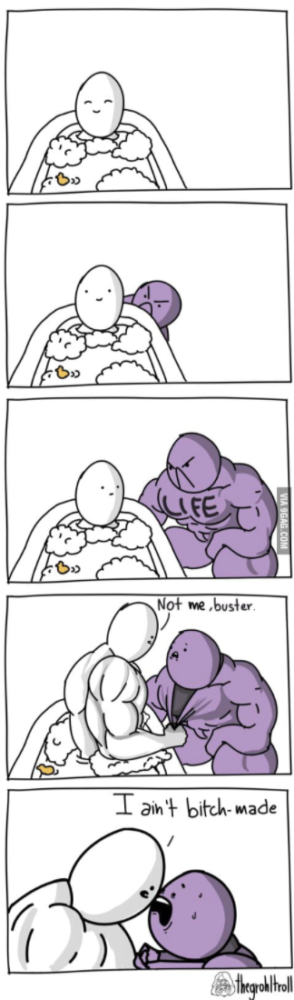
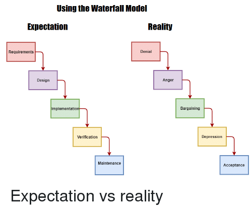
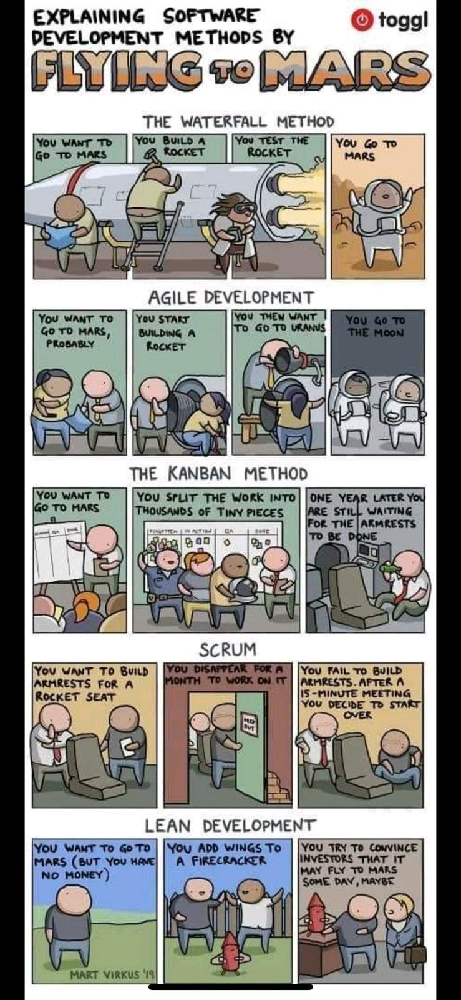
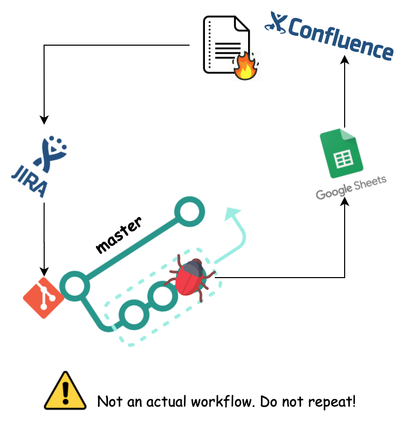
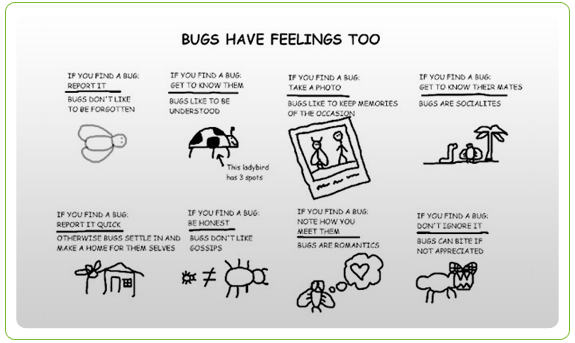
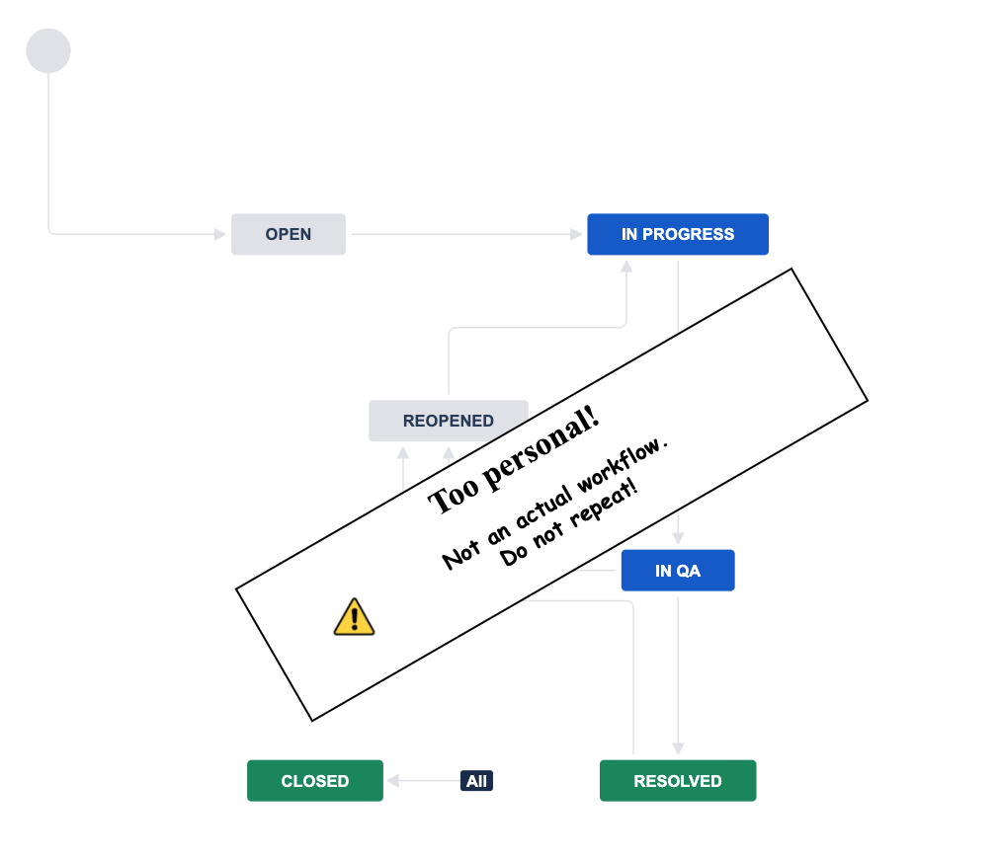
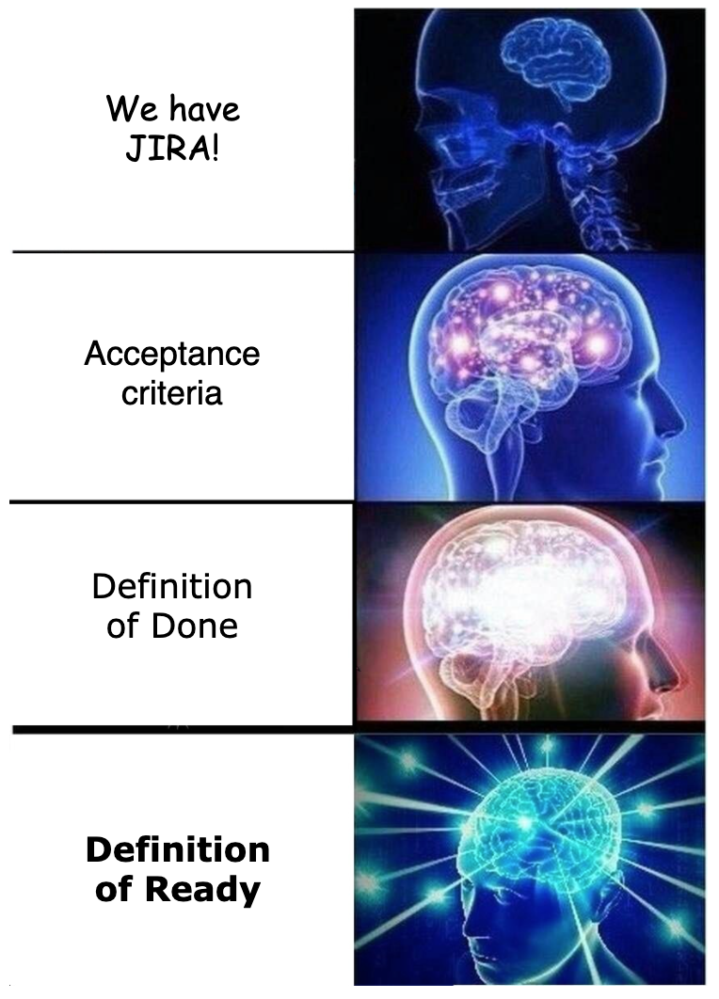
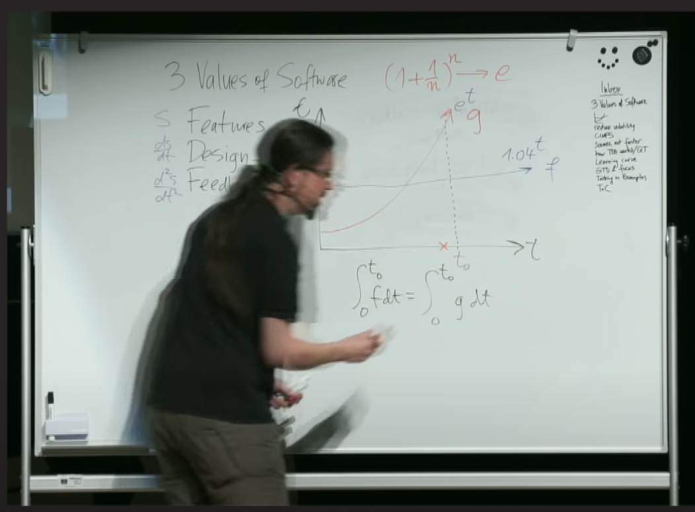
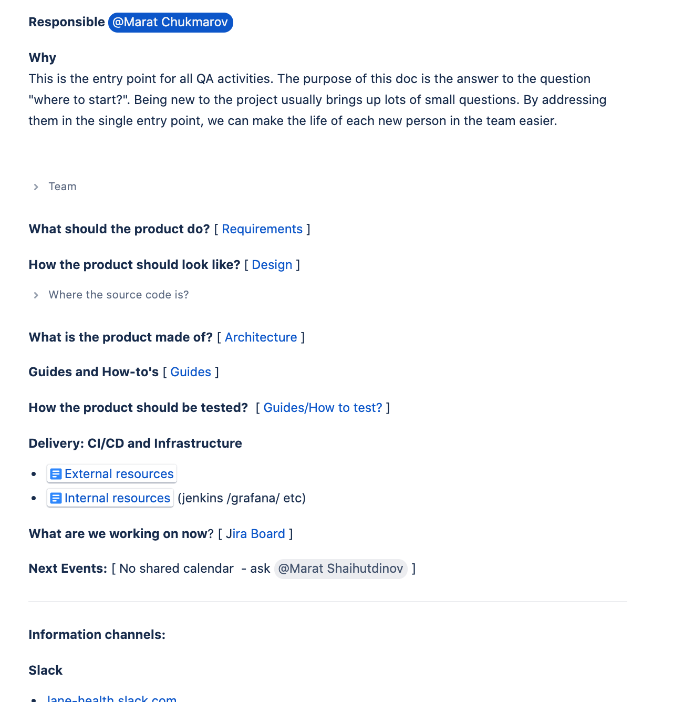

#  Testing starter kit

What to do on your first day in project as a tester.


######  Marat Chukmarov

> [Don't forget to share the slides](https://mikementor.github.io/mikementor/#/slides/testing-starter-kit)

---
<!-- paginate: true -->
# I'm new here. What is going on?

> [Don't forget to share the slides](https://mikementor.github.io/mikementor/#/slides/testing-starter-kit)

---
### Team
# What's the product name?
# Who's working on it?

>Who's the father of that ***not that well working*** service?



---
# What product made of? Architecture

>  "Oh no, we forgot about that kafka config in zookeeper..."

>  "Of course, it won't start, you need docker with kafka/postgres and **that microservice I forgot to mention** in readme..."

>  "What do you mean by '**Everything** is broken'?"

### [diagrams.net](http://diagrams.net/). But, also, take a look at [C4 model](https://c4model.com/)

---

# What the product should do? Requirements

>
> But, that's weird?!
> It always works **that** way.. But hey, indeed, that's weird



#### Keyword: *single source of truth*

> Also here, [ Design ] -  'how it should look like'


---
## How it's being delivered?


1. Environments
   1. dev/qa/preprod/prod/postprod/...
   2. Also, is there any **test data** I should be aware of?
2. CI / CD
   1. Jenkins and Co
   2. Also, **versioning**
   3. Also, **Deployment Notes**

---
## What's the current scope of work?



1. JIRA Boards
2. TCM (if applicable) (TestRail/Google sheets/etc..)


> Also, [Calendar of next events]


---
### Where do people talk?


> Oh, I didn't know, that you didn't know, we discussed that in slack
---
### How people do things? Guides


1. Bug reports
2. JIRA workflows
3. Developing culture
4. Testing
5. Docs maintaining
6. All the other guides

---
### Templates time! 
Yet another bug report template

```
1. Environment
2. Requirements
3. Preconditions
4. Steps
5. Expected Behavior
6. Actual Behavior
7. Hypothesis
8. Additional
```




> Hint, use [JIRA Direct HTML Links](https://confluence.atlassian.com/jirakb/how-to-create-issues-using-direct-html-links-in-jira-server-159474.html)

--- 
### Templates time! - JIRA


--- 
### Templates time! - JIRA

1.  Make sure, you have, at least, acceptance criteria
` If it does this, we're good`
2.  Awesome, if you have Definition of Done
  `No, we can't close ticket without tests`
3.  Great, if you have Definition of Ready
  ` Great, now we can start `

--- 
### Developing culture - Git

Tiers list
1. `We use branches!`
2. `We link tickets to PRs!`
3. `Our commmit messages have sense!`
4. `We run linters on pre-commit!`
5. `We have automated checks!`
6. `We have README!`

> for TS/JS pros - commitlint, eslint, prettier, lint-staged, husky, jest
> Also, here's some [nice little readme template](https://mikementor.github.io/mikementor/#/templates/repo-readme)
---
### Testing, finally

> 

1. Testing docs
2. Testers inputs of `What do I need to start?`
3. `What do you want from me?` or tester's report

---

### Testing docs

1. Links to guides
2. Links to Test case management systems / Google Sheets / etc
3. Dashboards (TCM results / Automation results / `hello,allure`)
4. Automation docs
   1. repos
   2. ci / how to's

> Hint: don't start TCM, just because you don't have it

---
### If there's no testing guide

1. Make a meeting
2. Ask a lot.
   1. `What are the risks?`
      1. services/infrastructure/client-specific/etc
   2. `How we're going to minimize them?`
      1. with automation
      2. with cool testability
         1. ability to easily reproduce
         2. ability to easily spot causes of problems
            1. logging/monitoring ....
3. Fix the talk!

--- 
### Hierarchy of automation

1. static checking / linters
2. units
3. big units
4. everything 2 else

> Hint: don't start your e2e before establishing the hierarchy
  

--- 
### Essential parts of testing - testers inputs

1. `Where?` - environments / versions
2. `What?` - scope (if not exists, try to make a meaningful abstraction. Also `Divide and conquer`)
3. `What the product should do?` - aside from `not  to crash` [Requirements]
4. Test data (credentials /...)

---
### Basic Tester's report



1. `Look, what I've found!` (tickets)
2. `I don't feel so good`
   1. Hadn't tested properly ***%_that_part_%*** / blocked
   2. These checks were unclear
   3. That was hard/inconvenient to test
   4. App was shaky to set up
3. `I had an idea!`(testability / challenge current processes)
4. `Launch time!` (Time spent)

> [Link to video](https://www.youtube.com/watch?v=TQ9rng6YFeY)

---
## Entry point - full

1. What's the product name? (Name)
2. Who's working on it? (Team)
3. What product made of? (Architecture)
4. What the product should do? (Requirements)
5. How it's being delivered? (Environments/CI/CD)
6. How the product should look like?  (Design)
7. How people here do things? (Guides)
8. Where people talk? (Info channels)
9. What the scope of work? (Boards/sprints)
10. Everything, that is out of that list.
  
### *Your list can be different.(but not much)*
---



# Recap

1. Don't panic
2. Ask tons of questions
3. Fix answers
4. Template everything!
   
----
# Thanks & Questions Slide

**Slides** 
[https://mikementor.github.io/mikementor/#/slides/testing-starter-kit](https://mikementor.github.io/mikementor/#/slides/testing-starter-kit)

**Templates** 
[https://mikementor.github.io/mikementor/#/templates](https://mikementor.github.io/mikementor/#/templates)

**Contacts**
Marat Chukmarov

**Telegram**: [@marchme](https://t.me/marchme)
